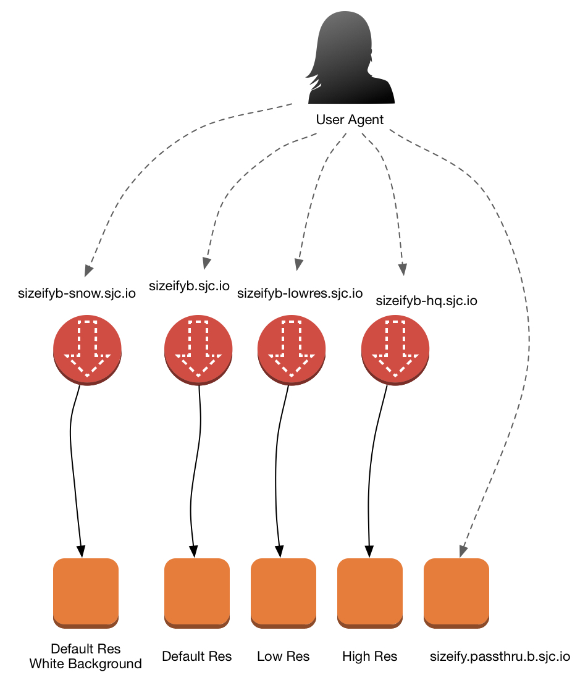

# sizeify-client

Official clients for Sizeify B.

## What is Sizeify B?

Sizeify is an image resizing service. It takes the URL of an image, and a code representing how it should be resized. It then caches (for a month) and serves the image effiently from Edge locations. It is a  useful tool for developers who wish to support designers who change their mind a lot.

Sizeify A is crappy and should not be used. 

## Installation

Clone this repo and pull out the files you need, or:

```bash
$ npm install @sean9999/sizeify-client
```

or:

```bash
$ bower install sizeify
```

or:

```bash
$ composer require sjc/sizeify
```

## How do you use sizeify?

There are two ways:

```
sizeify($endpoint,$imageUrl,$resizeCode)
```

or:

```
sizeify($imageUrl,$resizeCode)
```

where `$endpoint` is something like *http://sizeifyb.sjc.io* and `$imageUrl` is a fully qualified absolute URL like *http://www.linux.org/images/linux_org.png*, and `$resizeCode` is like:

Example  | What it does
------------- | -------------
w200  | resizes the width to 200, preserving aspect ratio
h150  | resizes the height to 200, preserving aspect ratio
50x75	| sizes the width to 50, and height to 75 (destroying aspect ratio)
l500	| resizes the image along it's longest dimension to 500.
s300	| resizes the image along it's shortest dimension to 300.
p110	| creates a square 110x110. White padding is used to maintain aspect ratio
b110	| same, but with black padding
g110	| same, but with gray padding
c200	| creates a square 200x200, cropping the image to preserve aspect ratio

Here is an Angular example: http://plnkr.co/edit/IM3xjJjErSfSYwenwott?p=preview

## What are the various endpoints?

Endpoint | Origin Server | Feature
--------- | ------------ | -------
sizeifyb.sjc.io	| sizeify.origin.b.sjc.io | Default endpoint. medium compression
sizeifyb-lowres.sjc.io	| sizeify.origin.cq.50.b.sjc.io | Low res
sizeifyb-hq.sjc.io	| sizeify.origin.cq.100.b.sjc.io	| High res
sizeifyb-snow.sjc.io	| sizeify.origin.snow.b.sjc.io	| Medium compression. PNGs with trasparency are given a white background.

## Architecture

Depending on the amount of compression you want, you can use one of several endpoints, as described here. The red images represent CDN distributions, and they are the official endpoints. The orange squares describe the origin servers. The fourth enpoint is suitable for testing. It bypasses the CDN altogether and does no caching.



## Advanced Usage

In addition to supporting the GET method, appropriate for using directly in `` tags, sizeify also supports:

Verb | What it does | Why it could be useful
--------- | ------------ | -------
POST	| Creates the cache	| Useful in scripts that do not want to reveice binary (image) data in response. Will return appropriate HTTP status codes if there was an error
HEAD	| Obtains meta information | Returns meta information of the object as an image (width,height,mime-type) and as a cache record (timestamp,TTL). HEAD returns 404 if the record does not exist, therefore HEAD has no side effects. GET, in contrast, creates records if they do not exist. It is important to note that this behaviour contravenes strict RESTful principals.
DELETE (against a variant)*	| Deletes the object	| Deletes the object if it exists. This is not instant. It triggers a "cache invalidation" request that is executed eventually on the CDN. The corresponding object deletion on the origin server is takes place immediately, but clients will see stale data for several minutes.
DELETE (against a folder)*	| Deletes all variants	| If you uploaded the wrong image and want to remove all traces, you want this.

*NOTE: [Deletes are expensive](https://twitter.com/codinghorror/status/506010907021828096). The best way to handle new data is to upload it to new enpoints and create new records on sizeify. Old data removes itself naturally after a month.