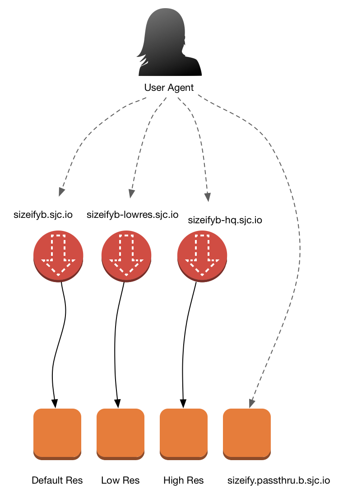

# sizeify-client

Official clients for Sizeify B, an improved image resizing service

## What is Sizeify?

Sizeify is an image resizing service. It takes the URL of an image, and a code representing how it should be resized. It then caches and serves the image effiently from Edge locations.

## Architecture

Depending on the amount of compression you want, you can use one of several endpoints, as described here. The fourth enpoint is suitable for testing, and does no caching whatsoever.

